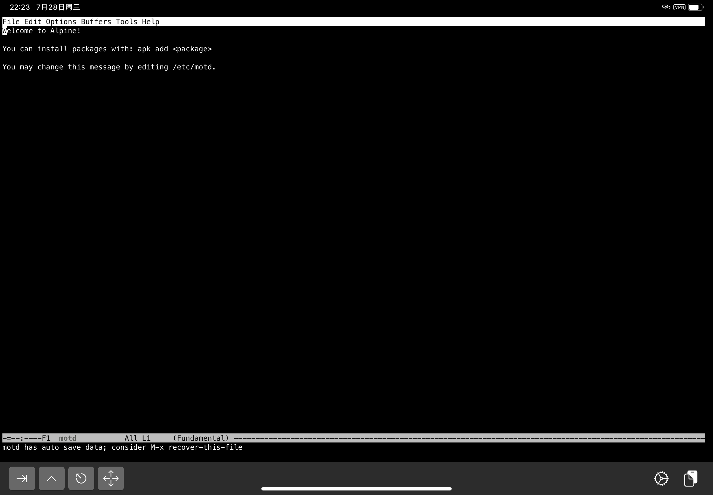
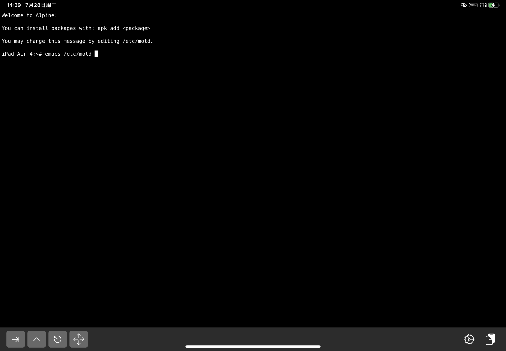
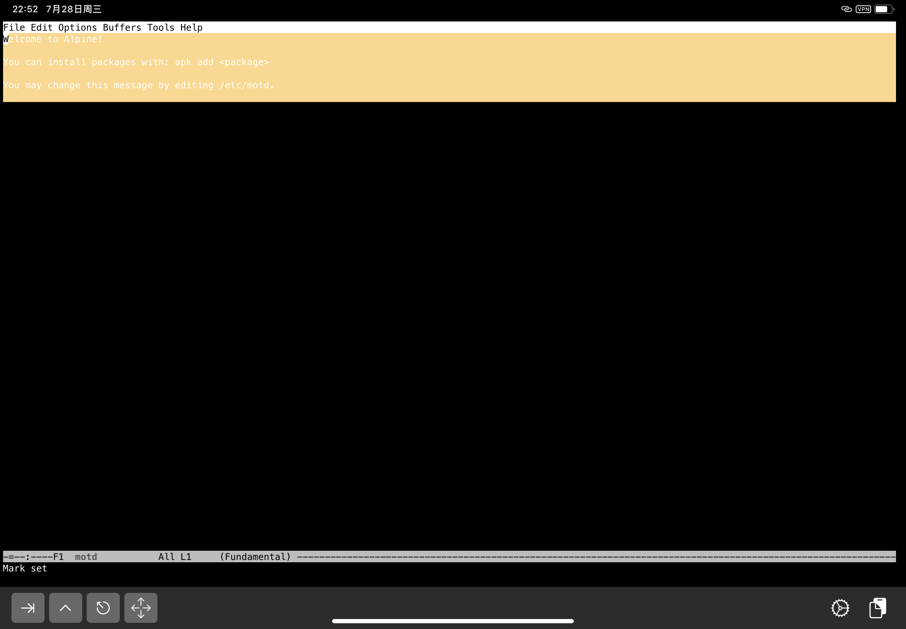
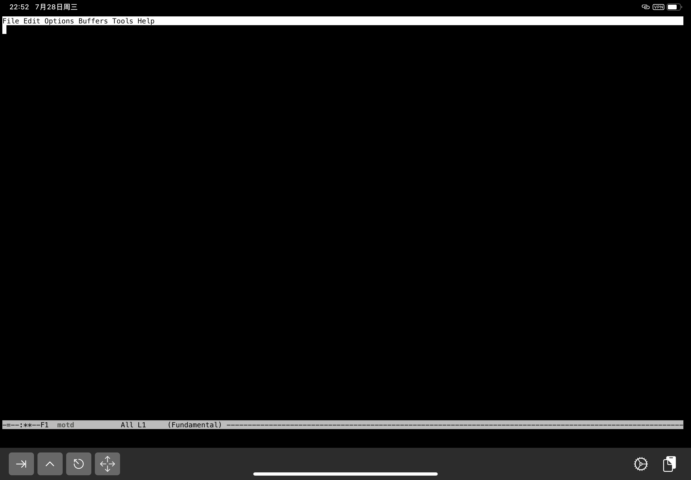
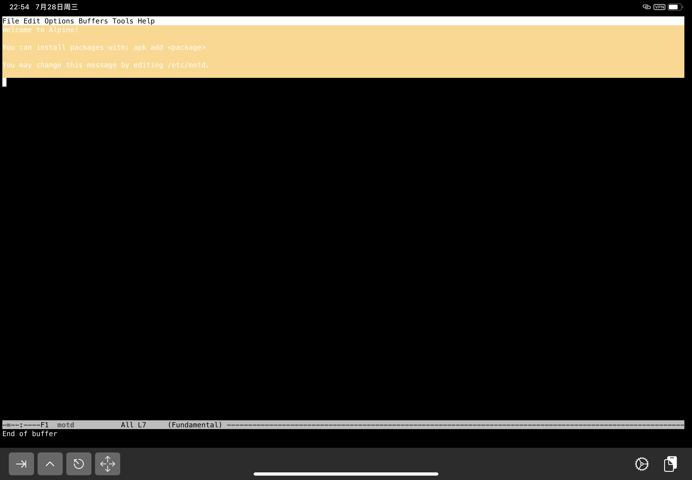
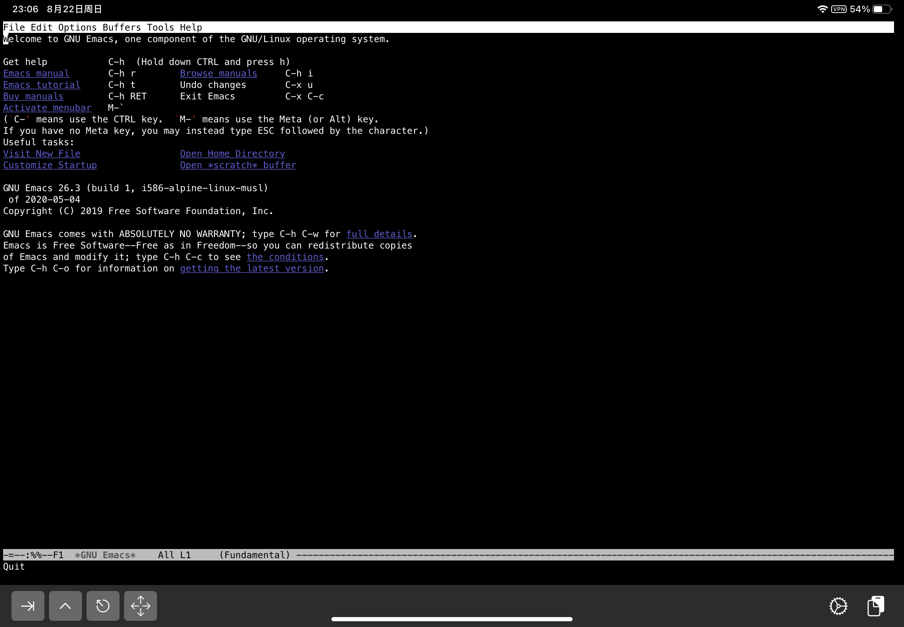
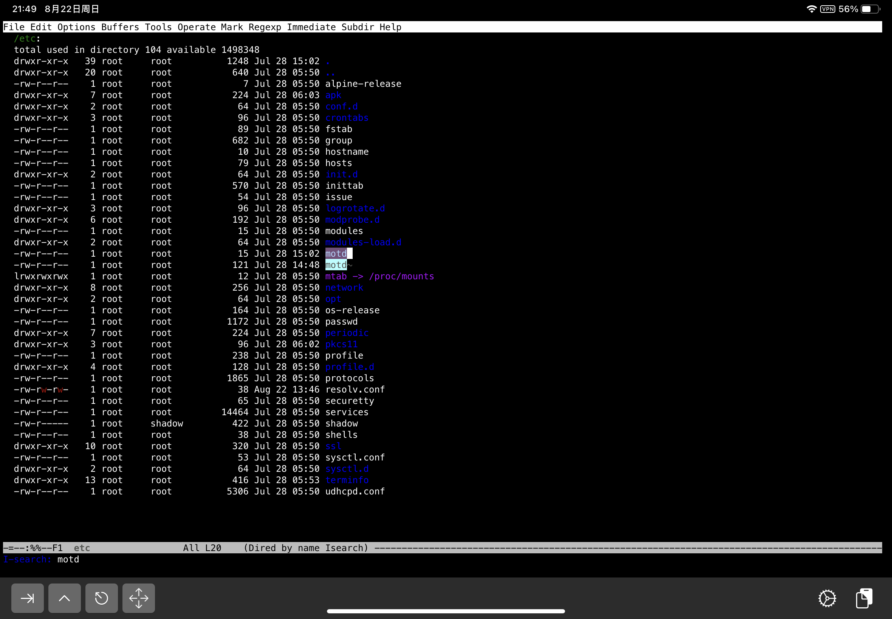
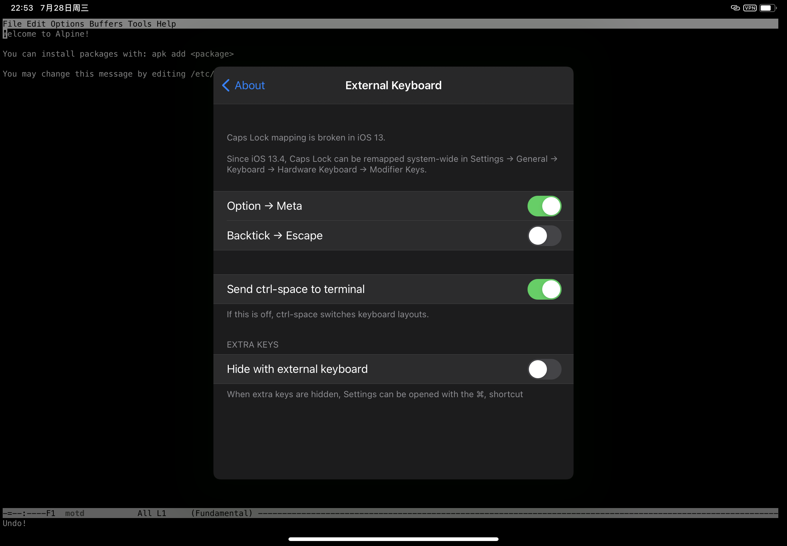

{:title "Vanilla Emacs"
 :layout :post
 :tags  ["emacs"]
 :toc false}

<span style="color:red">**Draft**</span>

> vanilla adj.
> 1. flavored with vanilla extract
> 2. plain and without any extras or adornments

Vanilla 作为形容词时，含义是1.香草味的，2.平淡的无任何添加的。用在编程语言或软件的语境下通常表示原生的，例如 Vanilla JavaScript vs. jQuery/React. 本文中 Vanilla Emacs 就表示原生 Emacs，区别于 Doom Emacs 或者 Spacemacs.

这篇文章主要讲原生 Emacs 的使用和配置，介绍如何把 Emacs 当做普通文本编辑器使用。<sup>[0]</sup>

首先，我们使用 Emacs 打开文件，修改内容并保存退出，然后使用 Emacs 查看文件夹并查找文件，最后，我们通过安装插件来介绍 Emacs 的包管理以及如何打开一个工程文件夹，并执行一些便捷的工程化操作。

## 安装

Doom Emacs 的入门指南里刚好有关于如何在 Linux, macOS, Windows 下安装 Emacs 的详细介绍，这里不在赘述。[链接](https://github.com/hlissner/doom-emacs/blob/develop/docs/getting_started.org#emacs--dependencies)。

## 使用

作为演示，我在 iPad 上通过 iSH<sup>[1]</sup> 安装了 Emacs 26.3<sup>[2]</sup>.

### 上手编辑文件

打开 iSH，在提示符上方有一段文字

```
Welcome to Alpine!

You can install packages with: apk add <package>

You may change this message by editing /etc/motd.


```



文件第三行告诉我们可以通过修改 `/etc/motd` 来改变这个每次进入 iSH 都会看到的提示消息<sup>[3]</sup>，那正好我们就可以用 Emacs 来编辑这个文件。

首先，输入 `emacs /etc/motd`，进入 Emacs，等待 motd 文件内容加载<sup>[4]</sup>。



看到文件内容之后，就可以开始改了，这里我准备把内容改为 ~~hello, world~~ `happy hacking`.

打开文件之后，跟普通的文本编辑器一样，在 Emacs 的文件内容区域里有一个光标，通过方向键可以移动光标的位置，按下字符键就输入了对应的字符。

所以，如何编辑呢？

#### 1. 删除原有内容

A. 既然当普通编辑器使用，自然我们可以使用方向键把光标移动到文本内容的最后，然后按住 Delete 直至文本内容全部删除。

B. 首先想到的是可以连续使用 `C-k`<sup>[5]</sup> 逐行删除

C. 通过 Stack Overflow 我知道了还可以使用 `C-x h C-w`<sup>[6]</sup>



D. 既然 `C-x h C-w` 可以，那么相同的原理，我想到了可以先使用 `C-SPC` 设置 Mark，然后移动光标选中所有内容（Region），最后使用 `C-w` 删除 Region<sup>[7]</sup><sup>[8]</sup>


BCD 都是 Emacs 特有的操作，和 A 相比，最大的区别在于手不需要移动太多去找方向键，而且能更快速地执行完成。

A 也有可以提升的空间，使用 Emacs 的光标控制动作可以更快的将光标移动到文件末，`C-n` 可以移动到下一行，`C-e` 可以移动到行末，这样会比使用方向键快不少，而如果使用 `M->` 则可以直接跳转到文件末，不过 `M->` 需要你有 Meta 键，通常 Meta 键是 Alt 键，在 iSH 上 Alt 键无效，可以使用虚拟键盘上的 ESC 图标按键代替。

#### 2. 输入 `happy hacking`，使用 `C-x C-s` 保存，然后使用 `C-x C-c` 退出 Emacs

#### 3. 退出并重新打开 iSH 就可以看到更新过的 motd 了


### 从 Emacs 中打开文件

刚才我们在命令行里直接将要编辑的文件路径传给了 Emacs，接下来我们在 Emacs 中查找浏览要编辑的文件。

重新打开 Emacs，我们会看到类似如下的欢迎界面，这被称为一个 buffer，buffer 的概念类似于一个标签页，后面会再说到。



使用 `C-x C-f` 来查找要打开的文件，在出现的输入提示符里键入要打开的文件的路径，输入时可以使用 tab 键补全，这个输入区域是一个 MiniBuffer，在成功找到要编辑的文件时，按下回车打开文件。

打开文件后的操作就与之前类似了。

#### Dired

当我们不知道要编辑的文件的具体路径时，我们可能需要通过浏览文件夹来查找要编辑的文件。

假设我们还是要编辑 `/etc/motd` 但是我们在只输入 `/etc` 的时候就按下回车键，此时，由于要打开的是文件夹，所以我们会看到一个显示文件夹内容的 buffer，显示的内容类似于对文件夹执行了 `ls -l`。



那么，要在这个 buffer 里怎么找到 `motd` 文件呢？

A. 和在之前的文本文件里移动没什么不同，依然可以使用方向键上下左右移动光标

B. 使用 Emacs 的光标控制动作，`C-n` 下一行和 `C-p` 上一行会更快一些

C. 使用 `C-s motd` 执行增量搜索，可以更快找到该文件

从 A 其实就可以看出 Emacs 在一致性上的优点了，不需要调起系统的文件浏览器，向操作文件一样操作文件夹列表，BC 则体现快捷键操作的便捷。

找到文件后，按下回车，就打开文件可以开始编辑了。

## 配置

<span style="color:red">**Draft Below**</span>

### 配置 MELPA

#### 使用 eww 搜索

打开 Emacs, 打开 eww

    M-x eww

使用 baidu.com 搜索 melpa, 找到清华大学开源软件镜像站的 MELPA 地址，复制并粘贴到 `~/.emacs.d/init.el` 中

> 1. eww 的导航
>     G    调出地址栏
>     l    eww-back-url
>     r    eww-forward-url
> 2. Emacs 复制粘贴
>     C-spc 设置 region
>     M-w   复制
>     C-y   粘贴

### 重载 Emacs 配置

    M-x eval-buffer
    M-x load-file

## 安装插件，修改主题

    M-x package-list-packages

先看看插件列表里 Archive 一列里有没有显示 MELPA，能不能搜索(C-s)到 dracula-theme, 刷新一下列表

    M-x package-refresh-contents

### 安装 Dracula 主题

    M-x package-install
    dracula-theme

### 加载主题

    (load-theme 'dracula t)

### 应用配置

除了可以重载整个配置文件之外，还可以应用单个配置，把光标放到表达式最后，执行

    C-x C-e

## 工程化管理

...

### Projectile

    (projectile-mode +1)
    (define-key projectile-mode-map (kbd "C-c p") 'projectile-command-map)

### Ivy

    (ivy-mode 1)

#### Counsel (Fuzzy)

    (setq ivy-re-builders-alist
          '((ivy-switch-buffer . ivy--regex-plus)
            (t . ivy--regex-fuzzy)))
    (setq ivy-initial-inputs-alist nil)

## Clojure

### Cider

> The lein executable isn’t on your ‘exec-path’

### lein

    curl https://raw.githubusercontent.com/technomancy/leiningen/stable/bin/lein > /usr/local/bin/lein


### Using cider

1. Cider jack in

## 所以这是 Vanilla Emacs，那 Doom Emacs 又是怎么回事呢？

学会了吗？

好，现在忘掉上面内容。我们看一下 Doom Emacs


---

<small style="color:#777">
0: 当然了，Emacs 能做很多事，甚至可以说是“所有事”，甚至也可以玩俄罗斯方块。

1: [https://ish.app/](https://ish.app/).

2: `apk add emacs`.

1&2: 为什么是 iPad? 这个原因我先按下不表，不过在 iPad 通过 iSH 使用 Emacs 作为基础介绍完全没问题。

3: motd 是 message of the day 的缩写，[https://en.wikipedia.org/wiki/Motd_(Unix)](https://en.wikipedia.org/wiki/Motd_(Unix)).

4: 此处就是暗示打开文件会有点慢，在我的 iPad Air 4 上需要大约 7\~12 秒。

5: 可以通过 Emacs 内置教程（`C-h t`）找到这个命令，也可以通过线上 [A Guided Tour of Emacs](https://www.gnu.org/software/emacs/tour/index.html) 的 Killing ("cutting") text 部分查看该命令。

6: https://stackoverflow.com/questions/12755367/how-to-clear-all-the-content-of-a-file-in-emacs, `C-x h` 和 `C-w` 也都可以从 [A Guided Tour of Emacs](https://www.gnu.org/software/emacs/tour/index.html) 的 Region 和 Killing ("cutting") text 部分查看该命令。

7: `C-SPC` 在 iPad 上默认切换输入法，可以通过 iSH 来设置接收该命令。
   

8: 如果想要把这几种方式都试一下，可以使用 `C-x u` 撤销更改后重试。
</small>
