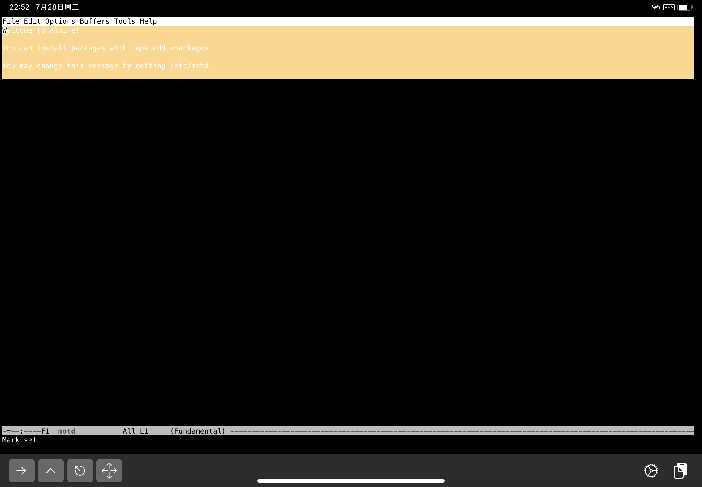
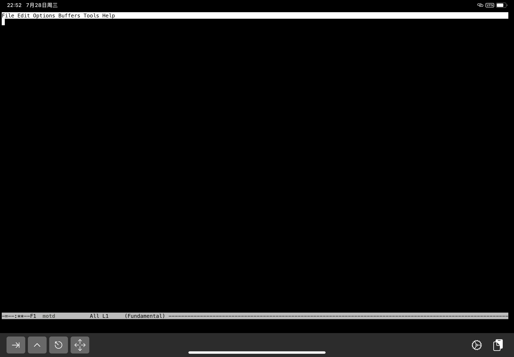
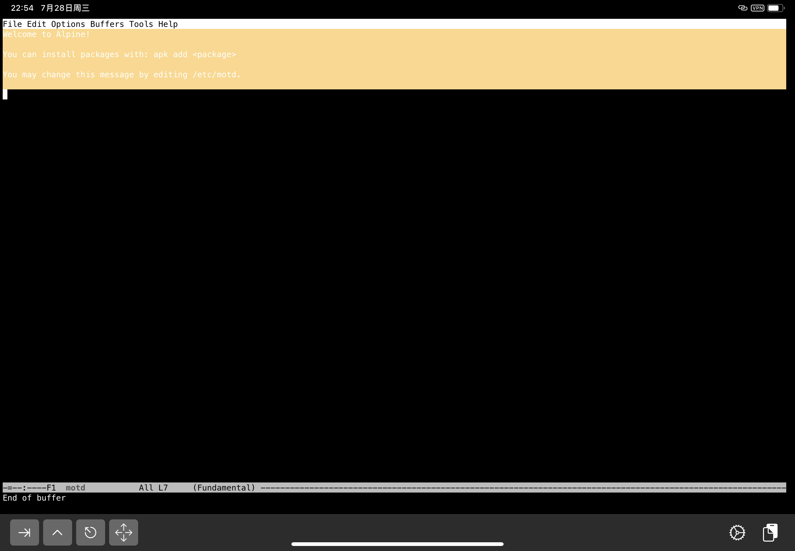
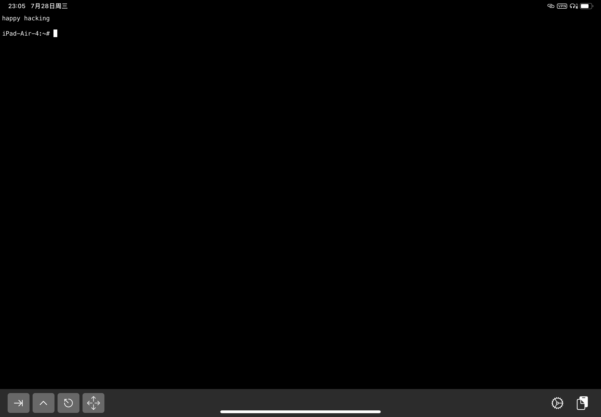
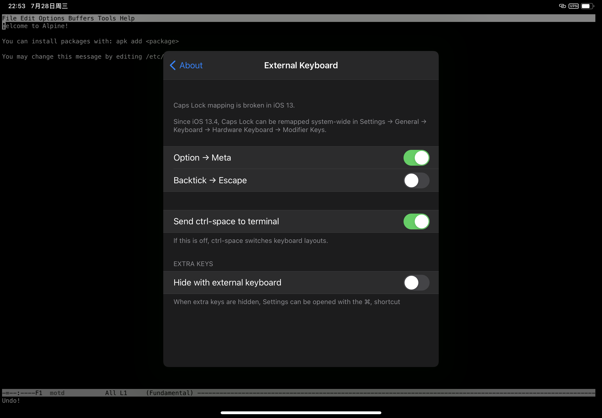

{:title "Vanilla Emacs"
 :layout :post
 :tags  ["emacs"]
 :toc false}

<span style="color:red">**Draft**</span>

> vanilla adj.
> 1. flavored with vanilla extract
> 2. plain and without any extras or adornments

Vanilla 作为形容词时，含义是1.香草味的或者2.平淡的无任何添加的。用在编程语言或软件的语境下通常表示原生的，例如 Vanilla JavaScript vs. jQuery/React. 本文中 Vanilla Emacs 就表示原生 Emacs，区别于 Doom Emacs 或者 Spaceemacs.

这篇文章主要讲原生 Emacs 的使用和配置，由于本人目前还是 Emacs 初级，只会涉及相当基础的内容。

具体一点，**使用**就是

- 编辑文件
- 访问工程里的文件夹和文件

**配置**就是

- 包管理与使用
- 配置文件的修改

## 安装

对，这篇文章主要讲 Emacs 的使用和配置。

## 使用

假设你是 Emacs 新手.
假设你已经安装了 Emacs.

作为演示，我在 iPad 上通过 iSH<sup>[1]</sup> 安装了 Emacs 26.3<sup>[2]</sup>.

### 上手编辑文件

打开 iSH，在提示符上方有一段文字

```
Welcome to Alpine!

You can install packages with: apk add <package>

You may change this message by editing /etc/motd.


```


重点看第三行，也就是告诉我们可以通过修改 `/etc/motd` 来改变这个每次进入 iSH 都会看到的提示消息<sup>[3]</sup>，那正好我们就可以用 Emacs 来编辑这个文件。

首先，输入 `emacs /etc/motd`，进入 Emacs，等待 motd 文件内容加载<sup>[4]</sup>。


看到文件内容之后，就可以开始改了，这里我准备把内容改为 ~~hello, world~~ `happy hacking`.

那么，如何编辑呢？

1. 删除原有内容
    - 我首先想到的是可以连续使用 `C-k`<sup>[5]</sup> 逐行删除
    - 通过 Stack Overflow 我知道了还可以使用 `C-x h C-w`<sup>[6]</sup>
      
      
    - 既然 `C-x h C-w` 可以，那么相同的原理，我想到了可以先使用 `C-SPC` 设置 Mark，然后移动光标选中所有内容（Region），最后使用 `C-w` 删除 Region<sup>[7]</sup><sup>[8]</sup>
      
2. 输入 `happy hacking`，使用 `C-x C-s` 保存，然后使用 `C-x C-c` 退出 Emacs
3. 退出并重新打开 iSH 就可以看到更新过的 motd 了
   

## First thing first. 配置 MELPA

### 使用 eww 搜索

打开 Emacs, 打开 eww

    M-x eww

使用 baidu.com 搜索 melpa, 找到清华大学开源软件镜像站的 MELPA 地址，复制并粘贴到 `~/.emacs.d/init.el` 中

> 1. eww 的导航
>     G    调出地址栏
>     l    eww-back-url
>     r    eww-forward-url
> 2. Emacs 复制粘贴
>     C-spc 设置 region
>     M-w   复制
>     C-y   粘贴

### 重载 Emacs 配置

    M-x eval-buffer
    M-x load-file

## 安装插件，修改主题

    M-x package-list-packages

先看看插件列表里 Archive 一列里有没有显示 MELPA，能不能搜索(C-s)到 dracula-theme, 刷新一下列表

    M-x package-refresh-contents

### 安装 Dracula 主题

    M-x package-install
    dracula-theme

### 加载主题

    (load-theme 'dracula t)

### 应用配置

除了可以重载整个配置文件之外，还可以应用单个配置，把光标放到表达式最后，执行

    C-x C-e

## 工程化管理

...

### Projectile

    (projectile-mode +1)
    (define-key projectile-mode-map (kbd "C-c p") 'projectile-command-map)

### Ivy

    (ivy-mode 1)

#### Counsel (Fuzzy)

    (setq ivy-re-builders-alist
          '((ivy-switch-buffer . ivy--regex-plus)
            (t . ivy--regex-fuzzy)))
    (setq ivy-initial-inputs-alist nil)

## Clojure

### Cider

> The lein executable isn’t on your ‘exec-path’

### lein

    curl https://raw.githubusercontent.com/technomancy/leiningen/stable/bin/lein > /usr/local/bin/lein


### Using cider

1. Cider jack in

## 剧透

学会了吗？

好，现在忘掉上面内容。我们看一下 Doom Emacs


---

<small style="color:#777">

1: [https://ish.app/](https://ish.app/).

2: `apk add emacs`.

3: motd 是 message of the day 的缩写，[https://en.wikipedia.org/wiki/Motd_(Unix)](https://en.wikipedia.org/wiki/Motd_(Unix)).

4: 此处就是暗示打开文件会有点慢，在我的 iPad Air 4 上需要大约 7\~12 秒。

5: 可以通过 Emacs 内置教程（`C-h t`）找到这个命令，也可以通过线上 [A Guided Tour of Emacs](https://www.gnu.org/software/emacs/tour/index.html) 的 Killing ("cutting") text 部分查看该命令。

6: https://stackoverflow.com/questions/12755367/how-to-clear-all-the-content-of-a-file-in-emacs, `C-x h` 和 `C-w` 也都可以从 [A Guided Tour of Emacs](https://www.gnu.org/software/emacs/tour/index.html) 的 Region 和 Killing ("cutting") text 部分查看该命令。

7: `C-SPC` 在 iPad 上默认切换输入法，可以通过 iSH 来设置接收该命令。
   

8: 如果想要把这几种方式都试一下，可以使用 `C-x u` 撤销更改后重试。
</small>
