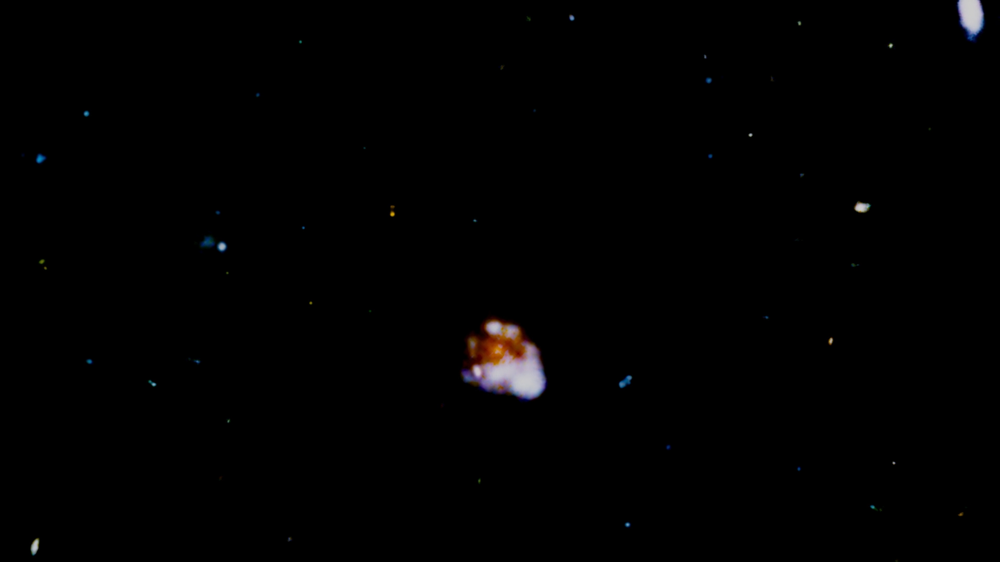

{:title "Hubble"
 :layout :post
 :tags ["blog"]
 :toc false
 :draft true
 :slug "hubble"
 :hide true
 :css true
 :js true
 :external-css ["https://cdnjs.cloudflare.com/ajax/libs/font-awesome/6.4.0/css/all.min.css"]}

{#earth-img}

```srt
36
00:03:58,420 --> 00:04:03,210
就是这里  被我们美丽的地球包裹着

37
00:04:03,380 --> 00:04:08,260
被太阳  这颗离我们最近恒星的光芒温暖着

38
00:04:09,300 --> 00:04:12,090
当你这么看着我们的家园时  你会觉得

39
00:04:12,260 --> 00:04:15,310
"在外面那些黑暗的空间里

40
00:04:15,470 --> 00:04:18,430
会不会有另一个像我们这样的地方

41
00:04:19,190 --> 00:04:22,020
那里会不会还有别的人"
```

```srt
611
00:41:39,610 --> 00:41:44,780
Hubble has given us a renewed perspective on the place we call home.

612
00:41:45,830 --> 00:41:51,250
We now know how important it is to protect this fragile oasis

613
00:41:51,420 --> 00:41:57,750
deep within the boundless reaches of Hubble's magnificent universe.
```


 {#image-container}

[<i class="fas fa-redo-alt"></i> Replay](){#replay-link}

```
599
00:40:30,920 --> 00:40:34,090
From this small sliver of a view,

600
00:40:34,260 --> 00:40:36,260
astronomers estimate

601
00:40:36,420 --> 00:40:42,010
there may be a hundred billion galaxies across the universe.
```

```
607
00:41:15,050 --> 00:41:16,980
Billions of galaxies,

608
00:41:16,980 --> 00:41:21,300
each with billions of stars.

609
00:41:26,140 --> 00:41:28,520
Doesn't it make you wonder?

610
00:41:28,680 --> 00:41:34,770
Will we ever find anywhere as perfect as our own planet Earth?
```
