{:title "回顾一下《编码》这本书"
 :layout :post
 :slug "book-review-code"
 :draft true
 :hide true
 }

> 计算机是二十世纪技术领域的“登峰造极之作”，它是一种值得欣赏、具有“美”学文化底蕴的人类伟大成果，这种“美”不需要明喻和暗喻的额外修饰。

作为今年看完的为数不多的书，而且是技术类书籍，特别想写一篇文章回顾一下。

这本书我在22年看过，但当时没有能够看完，大概是停在了第17章自动操作，在页数上可能刚过半，不过在内容深度上才刚开始。之前还写过两篇读书笔记，[《继电器》](https://huzuzhi.com/relay.html)和[《二进制》](https://huzuzhi.com/bit.html)。前不久恰好得闲，又翻起了这本书，一鼓作气看完了。

这本书用作者的话来说就是在保证内容深度的基础上保持了相对缓和的节奏。作者用了比较大的篇幅做铺垫，确保读者能够熟悉最核心的理论知识，然后再一层一层的构建出计算机工作原理的全貌。

虽然这本书出版的比较早（英文原版是1999年9月出版的），但是由于今天的计算机相比当年的计算机在本质上仍然是完全一致的，所以并不影响其内容的有效性。我前不久重新看的时候还发现这本书在23年出了第2版，作者在新版的序里还提到，这本书第1版出版的时候，相比他的其他技术书籍，他欣喜的发现他终于写了一本不需要修改的书😂️。之所以有第2版，除了一些因为技术变迁需要稍作更改的内容之外，主要是增加了对 CPU 内部工作原理的内容，处理了作者认为的第1版的不足。

正如作者在本书的序里说的，这是一本介绍计算机工作原理的书，而且一直深入到本质，作者希望读者看完之后对计算机工作原理的理解能够达到不逊于“电气工程师”和“程序员”的理解。

## 目标

只回顾我认为比较核心的内容，让我以后能够通过这篇文章回顾这本书的内容。

## 逻辑门

### 选猫器

#### 1. 布尔表达式

选猫器是书中用于介绍逻辑与开关的示例，很好的从开关电路过渡到逻辑门的运用。

> 或许某天你走进了一家宠物商店，对店员说：“我想要一只公猫，已绝育的，白色或褐色都可以，或者一只母猫，也要是已绝育的，除了白色任何颜色都可以；或者，只要是黑猫就可以。”店员会对你说：“你想要的猫是在以下这样的集合里：
>
> `(M x N x (W + T)) + (F x N x (1 - W)) + B`
>
> 对吗？”你会说：“是的！正是！”

虽然这个例子有点奇怪，但是让我们忽略它。

符号`x`在布尔代数中表示两个集合的交集，`+`表示并集。符号1与减号连用表示在全集中排除一些事物。

有了公式之后，就可以准对店员拿出的一只未绝育的褐色公猫进行布尔测试了，假如我们用数字1和0（代表true或false）来替换表示集合的字母，那么就会得到：

`(M x N x (W + T)) + (F x N x (1 - W)) + B`

`(1 x 0 x (0 + 1)) + (0 x 0 x (1 - 0)) + 0`

要计算结果利用的是运算符AND和OR的真值表：

| AND  | 0    | 1    |
| ---- | ---- | ---- |
| 0    | 0    | 0    |
| 1    | 0    | 1    |

| OR   | 0    | 1    |
| ---- | ---- | ---- |
| 0    | 0    | 1    |
| 1    | 1    | 1    |

计算结果是0,意味着这只未绝育的褐色公猫不符合标准。

#### 2. 电路

接下来，利用一节电池、一些导线以及一个灯泡，我们可以完成一个简单的选猫器。

两个串联的开关实现的是和运算符AND的一样的逻辑，而两个并联的开关则是和运算符OR一样的逻辑。

利用串联和并联，就可以用8个开关构建一个电路，实现选猫器。

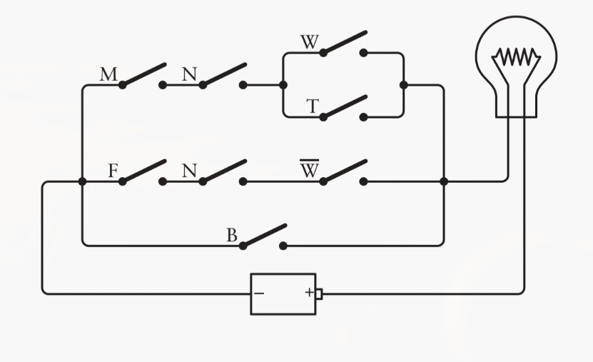

如果利用布尔代数简化了布尔表达式，那么也就对应简化了电路。之前的表达式是：

`(M x N x (W + T)) + (F x N x (1 - W)) + B`

利用结合律和分配律，表达式可以写为只有一个N的形式：

`(N x ((M x (W + T)) + (F x (1 - W)))) + B`

这样，开关减少了1个，总的需要7个开关。

但理论上，只需要4个开关来定义布尔表达式中要定义的猫。

#### 3. 二进制

为什么只需要4个开关呢？

首先，每个开关都是一个二进制数，一个开关代表性别，一个开关代表是否绝育，对于颜色，这里定义了4种选择，白色、黑色、褐色和其他，可以用两个二进制位来表示，所以需要两个颜色开关。再用一个灯泡来表示输出，于是我们就得到了下面的控制面板。

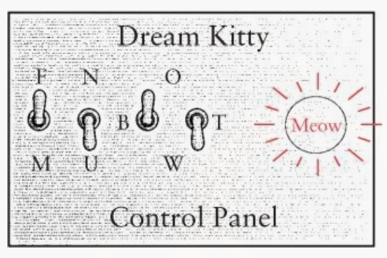

接下来要做的就是设计电路来实现控制面板的功能了。

#### 4. 逻辑门

继电器对于电报系统的工作而言是至关重要的，继电器通过通过放大微弱信号来生成强信号使得远距离通信成为可能，不过我们现在更加关心的不是放大信号，而是继电器可以作为电流控制而非人工控制的开关。

很显然，如果我们只关心把灯泡点亮，使用继电器真的是多余。但是，继电器优于开关之处就在于，继电器可以被其他继电器所控制，而不必人工控制。

通过连接继电器我们可以设计出与门、或门和反向器。

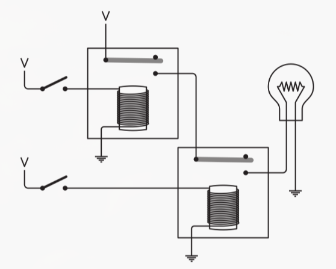

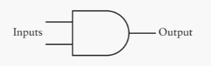

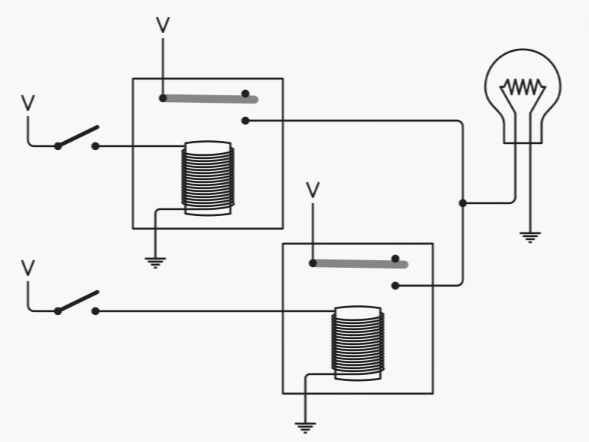

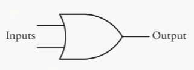

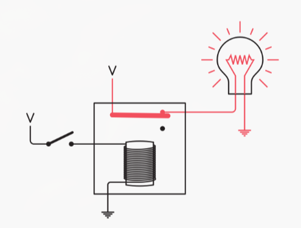

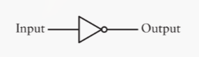

有了这几样东西，我们就可以重新设计选猫器了。

首先是性别，

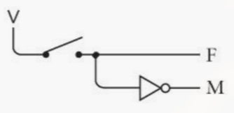

然后是是否绝育：

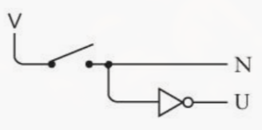

这两个电路是一样的，可以产生两个信号，当一个为1时另一个为0.

然后是颜色，由于颜色由两个开关控制，我们一个一个的来看，首先是白色，当两个开关都打开时：

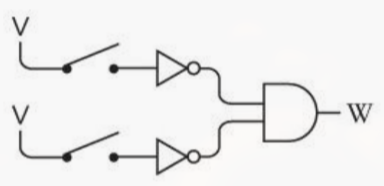

黑色，第一个开关闭合，第二个开关打开：

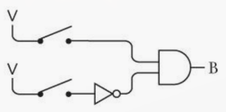

棕色，第一个开关打开，第二个开关闭合：

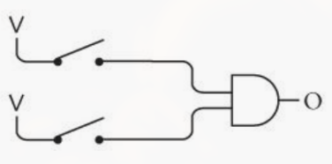

最后，其他颜色，两个开关都闭合：

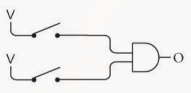

然后，把上面四个合起来得到了这两个开关的电路：

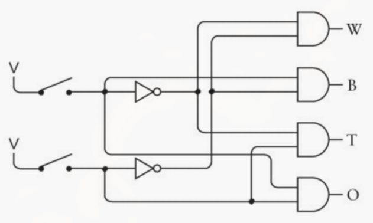

最后，使用逻辑门重新实现选猫器的布尔表达式，

`(N x ((M x (W + T)) + (F x (1 - W)))) + B`

其中每个`x`都是一个与门，每个`+`都是一个或门，(1-W)则使用反向器实现，那么我们就得到了：

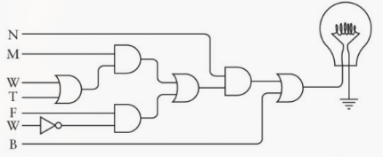

这样，把前面控制面板的电路和后面布尔表达式的电路控制连接起来，选猫器就完成了。

### 加法、减法和计数

TODO

## 算术自动化

TODO

## CPU控制信号

## 操作系统

